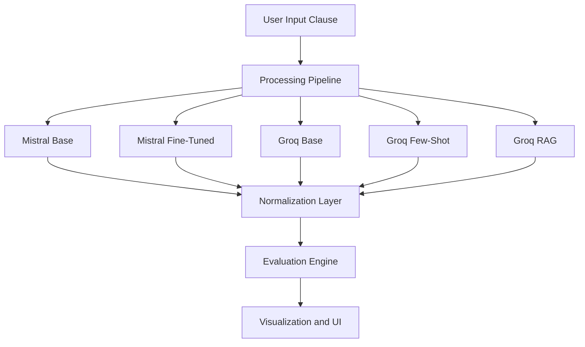
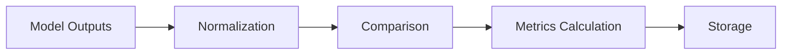
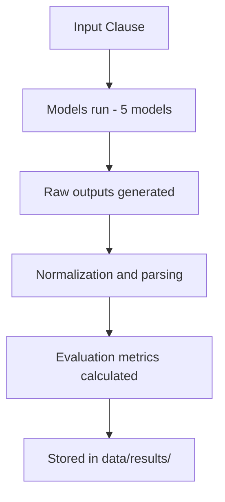
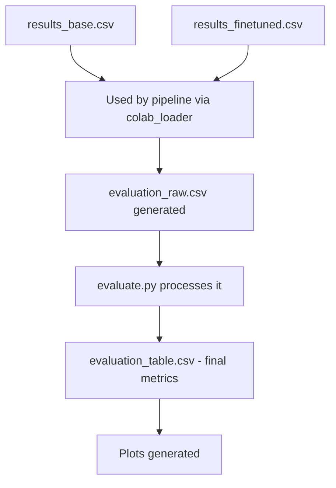
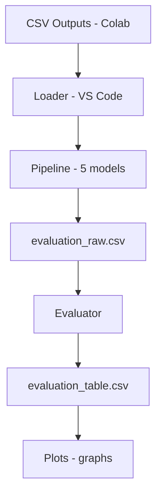

# Legal Clause Risk Analyzer using LLMs and RAG

## Comprehensive Project Report

---

# 1. Introduction

The rapid growth of digital platforms has led to widespread use of Terms of Service (ToS) agreements. These documents often contain complex legal language, making it difficult for users to understand potential risks. Many platforms exploit this complexity through dark patterns, which manipulate users into consenting to unfavorable conditions such as excessive data sharing, lack of transparency, or hidden obligations.

This project aims to build an AI-driven system that can automatically analyze legal clauses and detect such risks using advanced language models. The system compares multiple modeling approaches—baseline LLMs, fine-tuned models, prompt-engineered systems, and Retrieval-Augmented Generation (RAG)—to evaluate their effectiveness in legal reasoning.

---

# 2. Problem Statement

The core problem addressed in this project is:

```text
Automatically detect and classify dark patterns in Terms of Service clauses,
while also providing explainable and legally grounded reasoning.
```

### Key Challenges:

* Legal language is complex and ambiguous
* Traditional models lack contextual understanding
* LLMs often hallucinate or provide ungrounded reasoning
* Evaluation requires both classification accuracy and explanation quality

---

# 3. Objectives

The project aims to:

* Classify clauses as Predatory or Fair
* Identify the dark pattern category
* Generate clear explanations
* Reference relevant GDPR statutes
* Compare different AI approaches:
  * Base LLM
  * Fine-tuned LLM
  * Prompt-engineered LLM
  * Retrieval-Augmented LLM (RAG)

---

# 4. System Architecture Overview



---

# 5. Dataset and Data Processing

## 5.1 Dataset Used

The project uses the ToS;DR dataset, which contains annotated Terms of Service clauses labeled with fairness and user impact.

## 5.2 Data Cleaning and Labeling

* Raw dataset filtered to retain meaningful clauses
* Labels mapped to:
  * Predatory
  * Fair
* Additional balancing performed to ensure class distribution

## 5.3 Train-Test Split

* Split based on service-level grouping
* Ensures no leakage across services
* Balanced datasets created for:
  * Training
  * Testing

## 5.4 JSONL Creation

Training data converted into structured format:

```json
{
  "instruction": "...",
  "response": {
    "risk_status": "...",
    "dark_pattern_category": "...",
    "explanation": "...",
    "violated_statute": "..."
  }
}
```

This ensures:
* Consistency
* Learnability
* Structured output generation

---

# 6. Model Development (Colab Phase)

## 6.1 Base Model

* Mistral model used as baseline
* No task-specific training
* Used to understand zero-shot capability

## 6.2 Fine-Tuned Model

* Fine-tuned on ToS;DR dataset
* Learned:
  * Risk classification
  * Category mapping
  * Explanation structure

## 6.3 Output Storage

Due to deployment constraints:
* Model outputs generated in Colab were stored
* These outputs are later used during evaluation

```text
This approach allows evaluation without requiring live inference
for resource-heavy models.
```

---

# 7. VS Code Pipeline Implementation

## 7.1 Modular Design

The system is divided into:
* `pipeline.py`: Orchestrates all models
* `rag.py`: Handles GDPR retrieval
* `colab_loader.py`: Loads stored outputs
* `evaluate.py`: Computes metrics
* `visualize.py`: Generates graphs

## 7.2 Multi-Model Inference

### Groq Models (Live Inference)
* Base LLM
* Few-shot prompting
* RAG-based reasoning

### Mistral Models
* Outputs retrieved from stored results
* Integrated into pipeline for comparison

## 7.3 RAG Implementation

This section breaks down the architecture and flow of the custom GDPR RAG pipeline implemented in `rag.py`, which is responsible for grounding the model's responses in actual legal text.

The pipeline consists of 4 main steps:

### Step 1: Load and Clean (Document Ingestion)
* The pipeline ingests the raw GDPR text document (`data/gdpr.txt`).
* This serves as the single source of truth for all legal reasoning.

### Step 2: Smart Chunking and Filtering
* The text is split into sentence-aware chunks.
* Filtering: Only chunks between 50 and 400 characters that contain highly relevant legal keywords (like "Article", "data", "consent", or "processing") are kept.
* This ensures the LLM is only fed dense, high-quality legal context and not irrelevant filler text.

### Step 3: Embedding and Vector DB Construction
* Embedding Model: Uses `all-MiniLM-L6-v2` (via SentenceTransformers) to convert text chunks into vector embeddings.
* Vector Database: Uses `ChromaDB` (collection: `gdpr_v4`) to store and index these vectors for fast similarity search.

### Step 4: Retrieval and Smart Ranking
* When a user query is processed, it is embedded and queried against the vector database to retrieve the top 6 candidate chunks based on semantic similarity.
* Smart Re-ranking: A custom scoring function evaluates these candidates:
  * Boosts (+3) for mentioning "article".
  * Boosts (+1 to +2) for key concepts like "consent", "processing", or "data".
  * Penalizes (-1) for generic or overarching text (e.g., "scale", "technological developments").
* The top 3 re-ranked, highly relevant chunks are then injected into the Groq LLM prompt, forcing it to base its classification and reasoning solely on retrieved GDPR law.

## 7.4 Why RAG?

```text
Traditional LLMs rely on patterns.
RAG introduces factual grounding using external knowledge.
```

---

# 8. Evaluation Pipeline

## 8.1 Evaluation Data

* Test dataset processed through all models
* Outputs stored in `evaluation_raw.csv`

## 8.2 Metrics Used

### Classification Metrics:
* Accuracy
* Precision
* Recall
* F1 Score

### NLG Metrics:
* BLEU
* ROUGE

### Reliability Metrics:
* Hallucination Count
* Confidence Score

## 8.3 Evaluation Flow



## 8.4 Evaluation Data Storage and Architecture (data/results/)

The `data/results/` directory serves as the central evaluation repository for the system. It stores both precomputed model outputs and evaluation artifacts. This folder is your evaluation backbone; it stores model outputs (raw and processed), ground truth references, and final computed metrics. In simple words, this folder is the evidence of how well your system works.

### Flow Connection



### File-by-File Explanation

#### 1. evaluation_raw.csv
* **What it contains:** This is the most important file. It provides a row-by-row comparison of ALL models. Each row contains the clause, true_label, reference_explanation, and for each model: risk_status, category, explanation, statute, and confidence.
* **Role:** Acts as the master comparison table.
* **Why it matters:** This file is used to compute accuracy, compute BLEU/ROUGE, detect hallucinations, and compare models directly. It functions as the full experiment log.

#### 2. evaluation_table.csv
* **What it contains:** This is the final summarized metrics. Example columns include Accuracy, Precision, Recall, F1 Score, Avg Confidence, Hallucination Count, BLEU, and ROUGE.
* **Role:** Condenses all results into performance numbers.
* **Why it matters:** This file powers the graphs, the final comparison, and the report conclusions. It functions as the final scoreboard.

#### 3. results_base.csv
* **What it contains:** Precomputed outputs from Mistral Base. Each row contains the clause and the output (raw LLM response from Colab).
* **Role:** Simulates inference for the base model.
* **Why needed:** Because the Mistral model is not running locally. This file acts as the offline model output, serving as stored answers from the base model.

#### 4. results_finetuned.csv
* **What it contains:** Outputs from the fine-tuned Mistral model. It contains the clause, output, and true_label.
* **Role:** Provides fine-tuned model predictions for evaluation.
* **Important:** This file also acts as the source of ground truth labels and reference explanations (for BLEU/ROUGE). It functions as the trained model output and evaluation reference.

### How All Files Connect



### Full System View



### Why This Design Is Strong

* **Separation of Concerns:** Distinct stages for Tool, Training (Colab), Inference (Groq/Storage), CSV, Evaluation, and Python scripts.
* **Real-World Architecture:** Models are not retrained every time; outputs are stored.
* **Reproducibility:** The same results can be re-evaluated anytime.
* **Scalability:** New models can be easily plugged into the system.

The `data/results/` directory stores both precomputed model outputs and evaluation artifacts. The `results_base.csv` and `results_finetuned.csv` files contain outputs generated during the training phase in Colab, enabling offline evaluation without requiring real-time inference for those models. The `evaluation_raw.csv` file aggregates predictions from all models along with ground truth labels, forming the basis for metric computation. This file captures detailed, per-sample comparisons across models. The `evaluation_table.csv` file provides a summarized view of model performance, including classification metrics (accuracy, precision, recall, F1-score), hallucination counts, and NLG metrics (BLEU, ROUGE). This structured design ensures modularity, reproducibility, and efficient comparison across different modeling approaches.

**Final Note on Architecture:** This folder is not just storage — it is your entire evaluation system.

---

# 9. Results and Analysis

## 9.1 Classification Metrics across Models

This section compares Accuracy and F1-score across all five models (Mistral Base, Mistral Fine-tuned, Groq Base, Groq Few-shot, Groq RAG).

### Mistral Base
* **Accuracy:** Approx 0
* **F1-score:** Approx 0
* **Analysis:** Indicates complete failure to generalize for this task.
* **Interpretation:** The base model lacks task-specific alignment and fails to produce structured legal classifications.

### Mistral Fine-Tuned
* **Accuracy:** Approx 0.27
* **F1-score:** Approx 0.42
* **Analysis:** Shows improvement due to fine-tuning, but still weak.
* **Interpretation:** Fine-tuning helps the model learn patterns from the dataset, but it struggles with generalization and produces inconsistent outputs.

### Groq Base
* **Accuracy:** Approx 0.66
* **F1-score:** Approx 0.80
* **Analysis:** Strong baseline performance.
* **Interpretation:** Even without task-specific training, a powerful LLM understands general legal patterns and performs significantly better than fine-tuned small models.

### Groq Few-Shot
* **Accuracy:** Approx 0.63
* **F1-score:** Approx 0.77
* **Analysis:** Slight drop in accuracy, but still strong.
* **Interpretation:** Few-shot prompting improves output consistency but does not significantly outperform the base LLM.

### Groq RAG (Best Performer)
* **Accuracy:** Approx 0.83
* **F1-score:** Approx 0.90
* **Analysis:** Highest performance across all metrics.
* **Interpretation:** RAG enhances performance by injecting external legal knowledge (GDPR) and producing context-aware reasoning.

**Final Insight:** RAG significantly outperforms all other models, demonstrating the effectiveness of combining LLMs with external knowledge retrieval.

## 9.2 Text Similarity vs Reference (BLEU/ROUGE)

This section measures how similar model-generated explanations are to reference explanations using BLEU (precision-based similarity) and ROUGE (recall-based similarity).

### Key Observations

* **Groq Base and Few-shot:** Higher BLEU and ROUGE scores. Outputs are closer to the reference text.
* **Groq RAG:** Lower BLEU and ROUGE scores. Outputs are less similar to the reference.

### Critical Interpretation

Lower BLEU/ROUGE scores do NOT indicate worse performance.

**Why RAG scores lower:**
RAG generates original, context-grounded explanations using retrieved GDPR knowledge. It does NOT mimic dataset-style phrasing. Whereas base and few-shot models produce template-like responses.

**Final Insight:** BLEU and ROUGE measure linguistic similarity, not correctness. RAG sacrifices textual similarity in favor of deeper, legally grounded reasoning, making it more suitable for real-world legal analysis.

## 9.3 Hallucination Count by Model

This metric measures how often models produce incorrect, unsupported, or fabricated legal claims.

### Key Observations

* **Mistral Fine-Tuned:** Highest hallucination count (approx 18). Very unstable.
  * **Interpretation:** The fine-tuned model overfits patterns and generates confident but incorrect outputs.
* **Groq Base and Few-Shot:** Very low hallucinations (approx 1). Generally reliable, but not perfect.
* **Groq RAG:** Zero hallucinations. Most reliable model.

### Why RAG Reduces Hallucination
Because it is grounded in retrieved knowledge. Instead of guessing, RAG refers to actual GDPR content and produces fact-supported explanations.

**Final Insight:** RAG significantly reduces hallucinations, making it the most trustworthy model for legal applications.

## 9.4 Key Insight

```text
RAG improves:
- Accuracy
- Reliability
- Explainability
```

---

# 10. Frontend Implementation

## 10.1 Technology Used

* Streamlit

## 10.2 Features

* Clause input interface
* Multi-model output comparison
* Structured explanation display
* Visual differentiation of models
* Final summary and insights

## 10.3 Frontend Architecture and Execution Flow (Streamlit)

This section details how the Streamlit dashboard (`app.py`) operates, how it calculates and displays data, and the technical architecture behind the inference routing.

The frontend operates on a Hybrid Inference Architecture, balancing live API calls with offline data lookups to ensure performance and circumvent hardware limitations.

### Streamlit Execution and UI Flow
* **Initialization:** The app uses `@st.cache_resource` to load the `LegalAIPipeline` and `GDPRRAG` vector database into memory exactly once. This prevents costly reloading of embeddings on every user interaction.
* **User Interaction:** The user inputs a Terms of Service clause and clicks "Analyze".
* **Routing:** The app calls `pipeline.process(clause)`, which routes the input to all five models and returns a standardized dictionary of results.
* **Rendering:** The UI unpacks these results into a comparative grid. It applies dynamic styling, such as applying specialized badges and layout components to the RAG model to emphasize its context-aware reasoning.

### Hybrid Inference Mechanism (Technical Constraints and Solutions)
The system calculates predictions using two completely different technical approaches depending on the model:

**Live Inference (Groq Base, Few-shot, RAG)**
These models are lightweight to query via the Groq API. The pipeline sends the prompt (and retrieved GDPR context for RAG) over the network, waits for the LLM response, and parses the JSON output in real-time.

**Offline Lookup Inference (Mistral Base and Mistral Fine-Tuned)**
The Mistral models were trained and executed on Google Colab because hosting a large LLM requires substantial GPU VRAM, making it unfeasible to run locally or on standard cloud hosting.
To solve this hardware constraint:
* Their inferences on the dataset were precomputed on Colab, exported, and stored locally in the `data/results/` folder (`results_base.csv` and `results_finetuned.csv`).
* When a clause is analyzed, the pipeline does NOT execute a live forward pass through the Mistral models. Instead, it uses the `ColabResultsLoader` to perform an offline string-matching lookup against the stored dataset.
* Limitation: Because live inference is not happening for Mistral, if a user enters a completely novel clause that was not part of the Colab training/inference set, the system cannot generate a real-time prediction and falls back to a standardized static response.

### Metrics Calculation and Display
* Streamlit does NOT calculate metrics (Accuracy, F1-Score, Hallucination Count) on the fly, as calculating these requires running the entire dataset through an evaluator.
* Instead, it uses Pandas with `@st.cache_data` to load the pre-calculated `evaluation_table.csv` generated by the backend pipeline.
* It formats the raw floating-point numbers into human-readable percentages (e.g., converting `0.833` to `83.3%`) and displays them in the final UI grid, ensuring instantaneous load times for the dashboard analytics.

## 10.4 Output Presentation

Each model displays:
* Risk Status
* Category
* Explanation
* GDPR Reference

RAG output is enhanced with:
* Structured explanation
* Source attribution
* Legal grounding

---

# 11. System Design Strengths

* **Modular Architecture**
* **Separation of Training and Inference**
* **Real-time and Stored Model Integration**
* **Explainable AI outputs**
* **Reproducible evaluation**

---

# 12. Limitations

* Dataset labeling inconsistencies
* BLEU/ROUGE not ideal for legal reasoning
* Some mismatch between dataset labels and legal correctness
* Resource constraints prevent full local deployment of all models

---

# 13. Conclusion

The experimental results demonstrate that:

1. Base LLMs provide strong general performance but lack grounding.
2. Fine-tuning improves pattern recognition but introduces instability and hallucinations.
3. Few-shot prompting offers moderate improvements but does not significantly enhance reasoning.
4. Retrieval-Augmented Generation (RAG) achieves the best overall performance by combining:
   * High classification accuracy
   * Low hallucination rates
   * Legally grounded explanations

Although RAG shows lower BLEU/ROUGE scores, this is due to its ability to generate original, context-aware explanations rather than replicating reference text.

Therefore, RAG is the most effective and reliable approach for detecting dark patterns in legal documents.

Combining LLMs with retrieval mechanisms significantly improves the detection and explanation of dark patterns in legal text. RAG does not just predict—it justifies.

---

# 14. Future Work

* Improve dataset quality
* Add multi-jurisdiction legal datasets
* Enhance RAG retrieval precision
* Deploy scalable API-based system
* Integrate real-time legal databases

---

# Final Statement

```text
This system goes beyond classification—
it delivers explainable, legally grounded AI reasoning for real-world applications.
```
